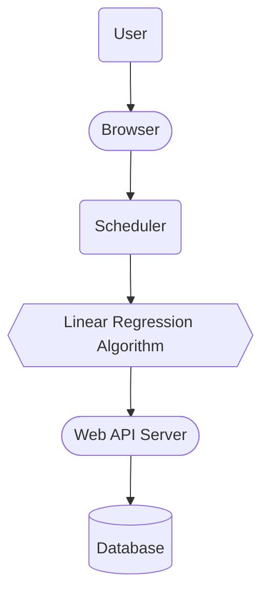

# e-BAKUNA

An Online Livestock Vaccination Scheduler and Monitoring System Using Linear Regression Algorithm
Features

## System Flow Chart of Proposed Methodology

## Technologies Stack

1. [Svelte](https://svelte.dev/) for web development
2. [.NET](https://dotnet.microsoft.com/en-us/) for web API
3. [MongoDB](https://www.mongodb.com/) for data persistence
4. [Docker](https://www.docker.com/) for deployment
